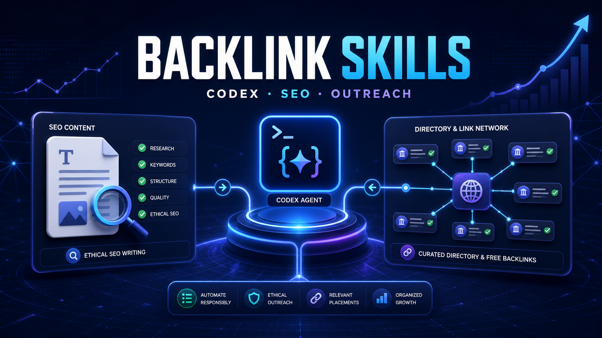

# Backlink Skills: directory submissions and SEO content with Codex



> An open-source collection maintained by the Flaq AI team from practical product-promotion work. It includes a public backlink candidate list, two product-directory submission skills, a general SEO writing skill, and platform-specific writing skills for LinkedIn, Medium, and WeChat.

This is not a one-click link-spam tool. It does not promise acceptance, dofollow links, indexing, traffic, or rankings. The project shares a more repeatable workflow: inspect destinations first, execute only authorized actions, hand native verification to the user, preserve evidence, and create content for the actual publication instead of syndicating one generic SEO article everywhere.

**Languages:** [简体中文（主文档）](README.md) · [English](README_en.md) · [繁體中文](README_tw.md) · [日本語](README_ja.md) · [한국어](README_ko.md) · [ไทย](README_th.md) · [Tiếng Việt](README_vi.md) · [Bahasa Indonesia](README_id.md) · [Español](README_es.md) · [Français](README_fr.md) · [Deutsch](README_de.md) · [Italiano](README_it.md) · [Português](README_pt.md) · [Русский](README_ru.md) · [العربية](README_ar.md) · [हिन्दी](README_hi.md) · [Türkçe](README_tr.md) · [Nederlands](README_nl.md) · [Polski](README_pl.md)

## Included workflows

| Component | Best for | Main capabilities |
|---|---|---|
| [`SPD V1 Batch`](submit-product-directories-v1-batch/SKILL.md) | Large, prequalified URL lists | Normalize, deduplicate, shard, verification-first queues, sequential form execution, recovery, throughput records |
| [`SPD V2 Quality`](submit-product-directories-v2-quality/SKILL.md) | Small quality-first campaigns | Up to 10 sites per batch, audience and SEO quality gates, action-level authorization, evidence and durability checks |
| [`writer`](writer/SKILL.md) | General website SEO articles | Brief, outline, fact-checking, SEO audit, rewrite, humanization, images, file packaging |
| [`linkedin-writer`](writer/linkedin-writer/SKILL.md) | LinkedIn Articles and newsletters | Topic research, business depth, thought leadership, SEO settings, publishing pack |
| [`medium-writer`](writer/medium-writer/SKILL.md) | Medium stories and Publication submissions | Topic and Publication fit, author perspective, narrative craft, AI disclosure, publishing pack |
| [`wechat-writer`](writer/wechat-writer/SKILL.md) | WeChat Official Account articles | Chinese topic planning, claim ledger, mobile readability, titles, digest, review, delivery pack |
| [Backlink candidate list](Free-backlink-list.md) | Finding candidates to recheck | 743 websites with individual Chinese summaries, batch/date, and operational notes |

## Choose a submission skill

Use `$submit-product-directories-v1-batch` when you already have a large set of legitimate and relevant URLs. V1 optimizes queue throughput, deduplication, verification handling, sequential execution within a browser profile, and resumability. “Batch” means batch planning and queue processing; it does not mean uncontrolled parallel submission or bypassing site limits.

Use `$submit-product-directories-v2-quality` when relevance, audience value, governance, referral potential, and listing durability matter more than volume. V2 uses small pilots of no more than 10 sites, qualifies every destination before form work, checks authorization for each consequential action, and keeps structured evidence.

When uncertain, start with V2 on 5–10 candidates. Move a larger approved list to V1 only after the product data, authorization, and route quality are understood.

## Public backlink candidate list

The repository publishes the list as [Markdown](Free-backlink-list.md). It contains 743 websites or submission routes. The historical submission-status column has been removed, and every website now has an individual Chinese summary describing its likely purpose and channel type.

The filename retains the team's internal “Free Backlink List” label, but not every entry is currently free or usable. The data intentionally preserves paid, closed, unavailable, reciprocal-link, article-only, duplicate, and unverified routes. Statuses are historical source notes, not independently verified current facts. Recheck every destination before using it and never copy a historical submission status into a new product campaign.

## Writing skills

The general `$writer` workflow creates and improves SEO-focused blog posts, tutorials, comparisons, listicles, explainers, FAQs, metadata, and local article packages. It covers search intent, current-claim verification, SEO auditing, audit-driven rewriting, humanization, 16:9 visuals, and optional Cloudflare R2 image delivery.

The platform skills use distinct editorial logic:

- `$linkedin-writer` creates professional long-form content, newsletters, business insight maps, LinkedIn SEO settings, discussion design, and a native publishing pack.
- `$medium-writer` works with Medium Topics and Publications, author-supplied experience, narrative structure, image labeling, responsible AI disclosure, and a Medium publishing pack.
- `$wechat-writer` creates Chinese WeChat articles with a claim-source ledger, mobile-first structure, titles and digest, editorial review, image planning, and a WeChat delivery pack.

Writing a local article and publishing it externally are separate actions. These skills do not publish merely because the user asks to write an article.

## Use with Codex

Codex skills preserve reusable instructions, resources, and scripts and can be invoked with `$skill-name`. See the [official OpenAI Codex skills use case](https://learn.chatgpt.com/use-cases/reusable-codex-skills).

Clone this repository and let Codex read the relevant folder, or copy only the skill directories you need into a Codex-discoverable Skills directory. Treat each folder with its own `SKILL.md` as a separate skill.

Example:

```text
Use $submit-product-directories-v2-quality to select no more than 10 relevant
candidates from Free-backlink-list.md. Run the quality, duplicate, verification,
and authorization checks first, then process eligible sites sequentially.
Do not pay, add reciprocal links, bypass verification, or retry an ambiguous
final submission. Save an auditable record.
```

```text
Use $writer to create an SEO comparison article for SaaS founders. Verify current
claims, then complete the outline, article, SEO audit, rewrite, humanization,
and local image plan. Save the article package and do not publish it.
```

## Repository layout

```text
.
├── README.md
├── README_en.md
├── README_*.md
├── Free-backlink-list.md
├── submit-product-directories-v1-batch/
├── submit-product-directories-v2-quality/
└── writer/
    ├── SKILL.md
    ├── linkedin-writer/
    ├── medium-writer/
    └── wechat-writer/
```

## Safety and limits

- Do not use the project for link spam, ranking manipulation, invented profiles, paid-link acquisition, forced reciprocal links, or prohibited automation.
- Never bypass CAPTCHA, Turnstile, 2FA, passkeys, email verification, or similar safeguards.
- Account creation, a saved draft, a click, or a redirect is not proof of publication.
- An ambiguous final action must be investigated before any retry.
- Measure relevant discovery, referrals, conversion, profile accuracy, and listing survival—not only submission or backlink counts.

## About Flaq.ai

[Flaq.ai](https://flaq.ai/) provides unified API access to image, video, music, and language models for AI agents and production applications. We maintain this repository to share practical, auditable, and reusable Codex workflows.

Related: [Awesome Codex Skills](https://github.com/flaqai/awesome_codex_skills) · [Awesome Claude Code Skills](https://github.com/flaqai/awesome_claude_code_skills)

## License

[MIT License](LICENSE)
